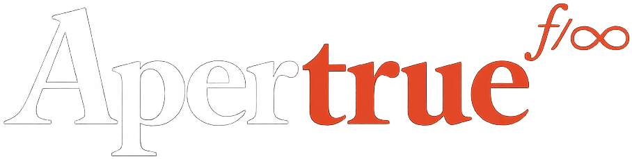

<p align="center">
  
</p>

<h3 align="center">ZK Circuits</h3>

<p align="center">
  Zero-knowledge circuits for C2PA media verification, written in <a href="https://noir-lang.org/">Noir</a>.
</p>

<p align="center">
  
  
  
  
</p>

---

These circuits prove that a photo or video has a valid [C2PA](https://c2pa.org/) signature from a trusted device — without revealing the device certificate, location, or any identifying metadata.

## Architecture

Apertrue uses a **split-proof architecture** that separates verification into two independent proofs running in parallel. This enables hardware-adaptive parallelism in the browser and supports RSA-4096 keys that exceed single-circuit constraints.

```
                    ┌─────────────────┐
  C2PA Image ──────▶│   ProofA         │──── Certificate chain valid
                    │   (5 variants)   │
                    └────────┬────────┘
                             │
                    ┌────────▼────────┐
                    │ Image Aggregator │──── Both proofs bound to same content
                    └────────┬────────┘
                             │
  C2PA Image ──────▶│   ProofB         │──── COSE signature valid,
                    │   (3 variants)   │     issuer in trust list
                    └─────────────────┘
                             │
                    ┌────────▼────────┐
                    │ Tree Aggregator  │──── Batch N images into 1 proof
                    └─────────────────┘
```

## Circuits

### Split-Proof: Certificate Chain Verification (ProofA)

| Circuit | Algorithm | What It Proves |
|---------|-----------|----------------|
| `proof_a_rsa_2048` | RSA-2048 + SHA-256 | X.509 certificate chain signature is valid |
| `proof_a_rsa_4096` | RSA-4096 + SHA-256 | Same, for 4096-bit keys (Adobe, ChatGPT) |
| `proof_a_ecdsa_p256` | ECDSA secp256r1 | Same, for P-256 curves (Google Pixel) |
| `proof_a_ecdsa_p384` | ECDSA secp384r1 | Same, for P-384 curves |
| `proof_a_skip` | — | Development bypass (no signature check) |

### Split-Proof: COSE Signature + Trust List (ProofB)

| Circuit | Algorithm | What It Proves |
|---------|-----------|----------------|
| `proof_b` | Generic | COSE signature valid, intermediate CA in Merkle trust list |
| `proof_b_es256` | ECDSA P-256 | Specialised for ES256 COSE signatures |
| `proof_b_ps256` | RSA-PSS + SHA-256 | Specialised for PS256 COSE signatures |

### Aggregation

| Circuit | Purpose |
|---------|---------|
| `image_aggregator` | Combines ProofA + ProofB for a single image with link commitment binding |
| `tree_aggregator` | Binary tree — combines 2 proofs into 1, reusable at any tree level |

### Privacy & Identity

| Circuit | Purpose |
|---------|---------|
| `selective_disclosure` | Proves image was verified without revealing private metadata (for on-chain use) |
| `anonymous_credential` | Group membership proof for anonymous identity credentials |
| `credential_registration` | Identity commitment and nullifier derivation |
| `jwt_identity` | JWT/OIDC claim verification for identity linking |

### Aztec Smart Contracts

| Contract | Purpose |
|----------|---------|
| `aztec_verifier` | On-chain proof verification + verification record storage |
| `webauthn_account` | WebAuthn P-256 account contract with session key support |

Both target [Aztec Network](https://aztec.network/) v4 devnet.

## Building

### Prerequisites

- [Nargo](https://noir-lang.org/docs/getting_started/installation/) **v1.0.0-beta.19** (not stable — circuits depend on beta.19-specific features)
- Docker (for Aztec contract transpilation only)

> **Version constraint**: These circuits require exactly `nargo` v1.0.0-beta.19. Later versions may introduce breaking changes to the constraint system or standard library. Install with:
> ```bash
> noirup -v 1.0.0-beta.19
> ```

### Compile

```bash
# Single circuit
cd proof_a_rsa_2048
nargo compile

# All circuits (from monorepo root)
./scripts/build-all-circuits.sh
```

### Test

```bash
cd proof_a_rsa_2048
nargo test
```

### Build Aztec Contracts

```bash
cd aztec_verifier
./build.sh                # Full: compile → AVM transpile → VK generation → TS codegen
./build.sh --skip-compile # Reprocess without recompiling
```

The build script runs `bb-avm aztec_process` in Docker for AVM transpilation and verification key generation, then generates TypeScript bindings via `@aztec/builder`.

## Dependencies

| Library | Version | Purpose |
|---------|---------|---------|
| `noir_rsa` | 0.10.0 (zkpassport fork) | RSA verification with PSS support |
| `bignum` | 0.9.2 | Big integer arithmetic for RSA |
| `sha256` | 0.3.0 | SHA-256 hash computation |
| `poseidon` | 0.1.1 | ZK-friendly Poseidon hash for commitments |
| `bb_proof_verification` | 4.0.0-devnet.2-patch.3 | Recursive proof verification (aggregation) |

The `noir_rsa` dependency uses [zkpassport's fork](https://github.com/zkpassport/noir_rsa) which adds RSA-PSS support required for Adobe and ChatGPT-signed images. Vendored snapshots under `vendor/` may use separately pinned versions for compatibility reasons (see `vendor/noir-rsa/VENDORED_FROM.md`).

## Security Model

- **Certificate chains verified in-circuit** — invalid signatures produce unsatisfiable constraints
- **Content hash binding** — prevents proof reuse across different images
- **Nullifiers** (content hash + leaf key hash) — prevent replay attacks
- **Commitment salts never revealed** — only Poseidon hashes are public outputs
- **Trust list Merkle proofs** — issuer inclusion proven against a signed oracle bundle
- **Known limitations**: Session key expiry and scope are stored in notes but not enforced in-circuit — expiry is checked client-side (documented in `webauthn_account/src/main.nr`)

## Acknowledgements

These circuits are built on the work of:

- [Noir](https://noir-lang.org/) by [Aztec Labs](https://aztec.network/) — zero-knowledge circuit language and compiler
- [Barretenberg](https://github.com/AztecProtocol/barretenberg) by Aztec Labs — UltraHonk proving backend and recursive verification
- [noir_rsa](https://github.com/zkpassport/noir_rsa) by [zkpassport](https://zkpassport.id/) — RSA verification with PSS support (enables Adobe and ChatGPT-signed images)
- [noir-jwt](https://github.com/saleel/noir-jwt) by [Saleel](https://github.com/saleel) — JWT/OIDC claim verification circuits
- [noir-bignum](https://github.com/noir-lang/noir-bignum) by Noir Lang — big integer arithmetic for RSA key operations
- [noir-edwards](https://github.com/noir-lang/noir-edwards) by Noir Lang — Edwards curve operations for anonymous credentials
- [zk-kit.noir](https://github.com/privacy-scaling-explorations/zk-kit.noir) by [Privacy & Scaling Explorations](https://pse.dev/) (Ethereum Foundation) — binary Merkle root verification
- [Poseidon](https://github.com/noir-lang/poseidon), [SHA-256](https://github.com/noir-lang/sha256), [Schnorr](https://github.com/noir-lang/schnorr), [Base64](https://github.com/noir-lang/noir_base64) by Noir Lang — standard cryptographic primitives
- [C2PA](https://c2pa.org/) — Coalition for Content Provenance and Authenticity open standard
- [Aztec Network](https://aztec.network/) — private smart contract platform (v4 devnet)

## License

Apache 2.0 — Copyright 2025-2026 Apertrue Ltd. See [LICENSE](./LICENSE).
